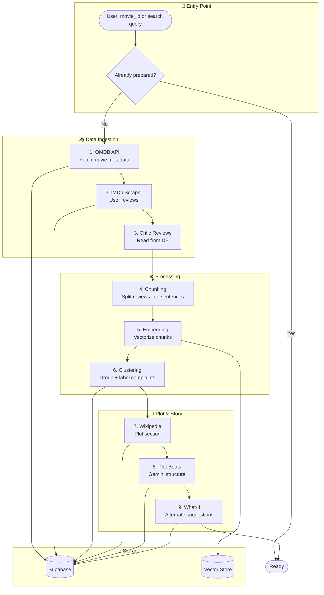
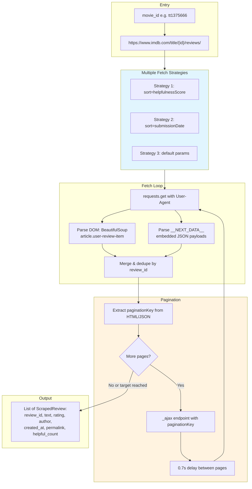
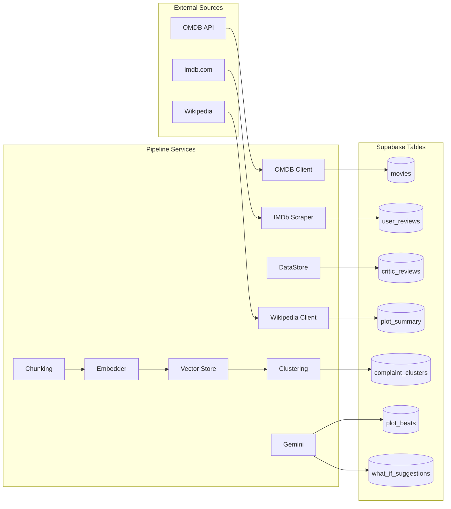
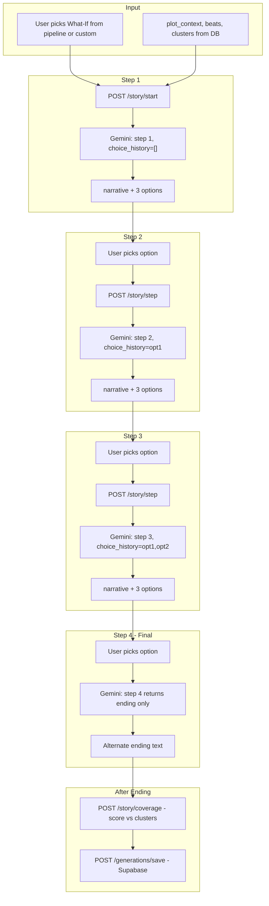

# Director's Cut — Pipeline Architecture

A visual guide to the main movie preparation pipeline, scrapers, and data flow.

> **Diagrams not rendering?** Open `docs/pipeline_architecture.html` in your browser for interactive Mermaid diagrams.

---

## Main Pipeline Overview



---

## Pipeline Steps (Detailed)

```mermaid
flowchart LR
    subgraph Step1["Step 1: OMDB"]
        S1_IN[Input: movie_id]
        S1_API[OMDB API]
        S1_OUT[Output: Title, Year, Plot, Poster, etc.]
        S1_IN --> S1_API --> S1_OUT
    end

    subgraph Step2["Step 2: IMDb Scraper"]
        S2_IN[Input: movie_id, max_reviews]
        S2_SCRAPE[Scrape reviews page]
        S2_OUT[Output: List of ScrapedReview]
        S2_IN --> S2_SCRAPE --> S2_OUT
    end

    subgraph Step3["Step 3: Critic Reviews"]
        S3_IN[Input: movie_id, title]
        S3_DB[Read from critic_reviews table]
        S3_OUT[Output: List of critic reviews]
        S3_IN --> S3_DB --> S3_OUT
    end

    subgraph Step4["Step 4: Chunking"]
        S4_IN[User + critic review text]
        S4_SPLIT[split_into_review_chunks<br/>max 3 sentences per chunk]
        S4_OUT[Output: chunks with chunk_id, text, source]
        S4_IN --> S4_SPLIT --> S4_OUT
    end

    subgraph Step5["Step 5: Embedding"]
        S5_IN[chunks.text]
        S5_ENC[EmbeddingService.encode]
        S5_OUT[Output: vectors + upsert to Vector Store]
        S5_IN --> S5_ENC --> S5_OUT
    end

    subgraph Step6["Step 6: Clustering"]
        S6_IN[chunks, vectors]
        S6_KMEANS[K-means clustering]
        S6_GEMINI[Gemini labels clusters]
        S6_OUT[Output: clusters + examples]
        S6_IN --> S6_KMEANS --> S6_GEMINI --> S6_OUT
    end

    subgraph Step7["Step 7: Wikipedia"]
        S7_IN[Input: title, year]
        S7_FETCH[Parsoid API → Plot section]
        S7_OUT[Output: plot_text, page_title]
        S7_IN --> S7_FETCH --> S7_OUT
    end

    subgraph Step8["Step 8: Plot Beats"]
        S8_IN[title, plot_text]
        S8_GEMINI[Gemini: generate_plot_package]
        S8_OUT[Output: beats, expanded_plot, characters]
        S8_IN --> S8_GEMINI --> S8_OUT
    end

    subgraph Step9["Step 9: What-If"]
        S9_IN[title, top 3 cluster labels, plot]
        S9_GEMINI[Gemini: generate_what_if]
        S9_OUT[Output: 3 alternate suggestions]
        S9_IN --> S9_GEMINI --> S9_OUT
    end
```



---

## IMDb Scraper — How It Works



### IMDb Scraper Details

| Aspect | Details |
|--------|---------|
| **Target** | `https://www.imdb.com/title/{imdb_id}/reviews/` |
| **Methods** | `requests` + BeautifulSoup (no Playwright) |
| **Strategies** | 3 entry points: helpfulness, date, default — to maximize review diversity |
| **Parsing** | DOM (`article`, `data-testid`) + embedded `__NEXT_DATA__` JSON |
| **Pagination** | Extracts `paginationKey` from HTML/JSON → `/_ajax` endpoint |
| **Min reviews** | 300 (configurable); pipeline requires 300+ for clustering |
| **Max pages** | 80 per strategy; 0.7s delay to avoid rate limits |

---

## Wikipedia Plot Scraper — How It Works

```mermaid
flowchart TB
    subgraph Entry["Entry"]
        TITLE[movie_title e.g. Inception]
        YEAR[movie_year e.g. 2010]
    end

    subgraph Lookup["Title Resolution"]
        L1["Try: 'Inception'"]
        L2["Try: 'Inception (2010 film)'"]
        L3["Try: 'Inception (film)'"]
    end

    subgraph Fetch["Fetch"]
        API["Parsoid REST API<br/>/api/rest_v1/page/html/{title}"]
        SOUP[BeautifulSoup parse HTML]
    end

    subgraph Extract["Extract Plot Section"]
        SECTIONS[Find all section elements]
        PLOT_H2[Find section with heading = 'Plot']
        PARAGRAPHS[Extract p tags from Plot section]
        CLEAN[Remove citation markers [1], [2]]
    end

    subgraph Output["Output"]
        RESULT["(plot_text, page_title)"]
    end

    TITLE --> L1
    YEAR --> L2
    L1 -->|404| L2
    L2 -->|404| L3
    L1 -->|OK| API
    L2 -->|OK| API
    L3 -->|OK| API
    API --> SOUP
    SOUP --> SECTIONS
    SECTIONS --> PLOT_H2
    PLOT_H2 --> PARAGRAPHS
    PARAGRAPHS --> CLEAN
    CLEAN --> RESULT
```

### Wikipedia Scraper Details

| Aspect | Details |
|--------|---------|
| **API** | Wikipedia Parsoid REST API (clean HTML, not raw wikitext) |
| **URL** | `https://en.wikipedia.org/api/rest_v1/page/html/{Title}` |
| **Fallbacks** | Direct title → "Title (year film)" → "Title (film)" |
| **Extraction** | Locate `<section>` with heading exactly "Plot", extract `<p>` tags |
| **Fallback** | If Wikipedia fails → OMDB plot from Step 1 |

---

## Data Flow Summary



---

## Alternate Ending Generation — How It Works



### Alternate Generation Flow

| Step | Action | Gemini Input | Output |
|------|--------|--------------|--------|
| **Start** | User picks what-if | movie_title, what_if, plot_context, beats, step=1 | narrative + 3 options |
| **Step 2** | User picks option 1 | + choice_history=[opt1] | narrative + 3 options |
| **Step 3** | User picks option 2 | + choice_history=[opt1, opt2] | narrative + 3 options |
| **Step 4** | User picks option 3 | step=4, choice_history=[opt1, opt2, opt3] | **ending** (no options) |
| **Score** | After ending | ending_text, clusters | Theme coverage score |
| **Save** | User saves | story_session_id, ending, what_if, history | generations table |

---

## Running the Pipeline

| Mode | Command | DB Writes |
|------|---------|-----------|
| **Full (with DB)** | `python -m scripts.run_full_pipeline tt1375666` | Yes |
| **Dry run (all steps)** | `python -m scripts.run_pipeline_step --movie-id tt1375666 --step all` | No |
| **Single step** | `python -m scripts.run_pipeline_step --movie-id tt1375666 --step imdb_scraper` | No |
| **Save outputs** | Add `--save-response ./pipeline_outputs` | Saves JSON per step |

---

## Pipeline Output Files (when `--save-output`)

| File | Step | Contents |
|------|------|----------|
| `01_omdb.json` | OMDB | Movie metadata |
| `02_imdb_reviews.json` | IMDb scraper | Review count + samples |
| `03_critic_reviews.json` | Critic | Count + samples |
| `04_chunks.json` | Chunking | Chunk count + samples |
| `05_embed.json` | Embedding | Vector count + dimension |
| `06_cluster.json` | Clustering | Clusters + example snippets |
| `07_wikipedia.json` | Wikipedia | Plot text + page title |
| `08_plot_beats.json` | Plot beats | Beats, expanded_plot, characters |
| `09_what_if.json` | What-if | 3 suggestions + cluster labels |
